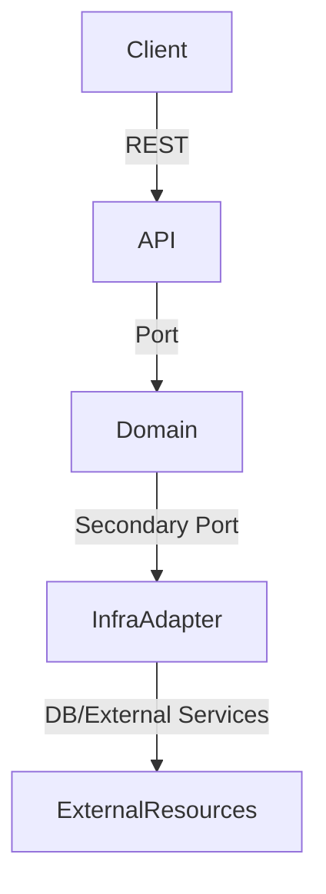
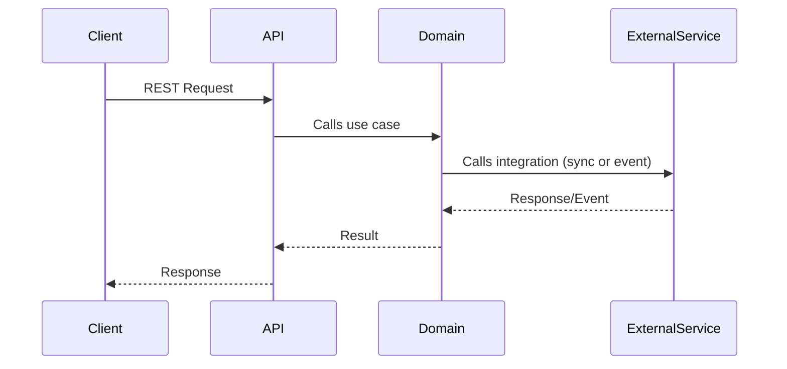

# RFC-001: StellarStay Hotels System Architecture

## 1. Executive Summary and Requirements

### 1.1 Problem Description and Business Challenges
StellarStay Hotels faces the challenge of scaling its reservation system from 1,000 to over 50,000 bookings per day, while maintaining high availability (99.9% uptime) and managing complex dynamic pricing, external integrations (payments, notifications), and advanced business rules. The system must handle traffic spikes, ensure reservation integrity, and provide a seamless experience for both customers and operators.

### 1.2 Proposed Architectural Approach
A hexagonal (Ports & Adapters) architecture based on microservices is proposed, where each business domain (reservations, pricing, rooms, payments, notifications) is an independent, decoupled, and scalable service. Communication between services will be synchronous (REST) for critical operations and asynchronous (events) for integrations and decoupled processes. The separation between business logic and infrastructure details is prioritized, facilitating maintainability and system evolution.

### 1.3 Key Technical and Business Requirements
- Horizontal scalability to support booking growth.
- Availability ≥ 99.9% during peak periods.
- Dynamic pricing engine with configurable rules.
- Robust integrations with payment and notification systems.
- Consistency and reliability in reservation and inventory management.
- Observability: metrics, logs, and request tracing.
- Error handling strategies and reliability patterns (circuit breaker, retry, bulkhead).

### 1.4 Success Metrics and Limitations
- Ability to process >50,000 bookings/day with <300ms latency for critical operations.
- Availability ≥ 99.9% measured by monitoring and alerts.
- Success rate in bookings and payments >99%.
- Scalability validated through load testing.
- Limitations: Dependence on external integrations, network latency, infrastructure budget.

---

## 2. System Architecture

### 2.1 Service Architecture (Hexagonal Design)

#### Pricing Service
- Main business responsibilities: Calculate dynamic room prices applying business rules (base rate, weekends, duration discounts, breakfast).
- Primary ports (incoming interfaces):
  - REST API for price queries.
  - Domain port for price calculation from other services.
- Secondary ports (outgoing interfaces):
  - Access to pricing rules repository.
- Key adapters needed:
  - REST adapter (API exposure).
  - Persistence adapter for rules.

#### Reservation Service
- Main business responsibilities: Manage the reservation lifecycle (creation, query, cancellation), validating availability and applying business rules.
- Primary ports (incoming interfaces):
  - REST API for reservation management.
  - Domain port for internal operations.
- Secondary ports (outgoing interfaces):
  - Access to room inventory.
  - Integration with payments and notifications.
- Key adapters needed:
  - REST adapter (API exposure).
  - Persistence adapter for reservations.
  - Integration adapter for payments and notifications.

#### Room Service
- Main business responsibilities: Manage room inventory, availability, and room types.
- Primary ports (incoming interfaces):
  - REST API for room queries and management.
  - Domain port for availability validation.
- Secondary ports (outgoing interfaces):
  - Access to room database.
- Key adapters needed:
  - REST adapter (API exposure).
  - Persistence adapter for rooms.

#### Payment Service
- Main business responsibilities: Process reservation payments, validate transactions, and manage payment states.
- Primary ports (incoming interfaces):
  - REST API to initiate payments.
  - Domain port for payment requests from reservations.
- Secondary ports (outgoing interfaces):
  - Integration with external payment gateways.
- Key adapters needed:
  - REST adapter (API exposure).
  - Integration adapter for payment gateway.

#### Notification Service
- Main business responsibilities: Send notifications to customers (email, SMS) about reservation and payment status.
- Primary ports (incoming interfaces):
  - REST API for sending notifications.
  - Domain port for reservation/payment events.
- Secondary ports (outgoing interfaces):
  - Integration with email/SMS services.
- Key adapters needed:
  - REST adapter (API exposure).
  - Integration adapter for messaging services.

### 2.2 Communication Architecture

#### Synchronous Communication
- Operations requiring immediate responses:
  - Room availability query (GET /api/rooms/available).
  - Reservation creation and confirmation (POST /api/reservations).
  - Real-time payment processing.
- API design patterns and error strategies:
  - RESTful APIs with input validation and structured (JSON) responses.
  - Error handling with clear HTTP codes (400, 404, 409, 500) and detailed messages.
  - Use of Correlation ID for request tracing.
  - Circuit breaker and retry implementation for critical service calls.
- Performance and SLA requirements:
  - Max latency <300ms for critical operations.
  - Availability ≥ 99.9%.
  - Consistent and predictable responses under load.

#### Asynchronous Communication
- Event-driven workflows and data flows:
  - Sending notifications after reservation or payment confirmation.
  - Inventory updates and synchronization with external systems.
- Event types and message structures:
  - Domain events: ReservationCreated, PaymentConfirmed, NotificationSent.
  - Messages in JSON format, with tracing metadata.
- Reliability and failure management:
  - Use of message brokers/queues (e.g., Kafka, RabbitMQ) with guaranteed delivery.
  - Event persistence for retries and auditing.
  - Dead-letter queues for unprocessed messages.

---

## 3. Scalability and Reliability Strategy

### 3.1 Scalability Design
- Horizontal/vertical scalability approach:
  - Decoupled services deployable independently, allowing horizontal scaling as needed.
  - Use of containers (Docker) and orchestration (Kubernetes) for automatic scaling management.
  - Vertical scalability for databases and critical services if necessary.
- Database scalability (partitioning, replicas):
  - Databases partitioned by service (Database per Service pattern).
  - Read replicas to balance load and improve performance.
  - Partitioning/sharding strategies for reservations and payments.
- Caching architecture and strategies:
  - Use of distributed cache (e.g., Redis) for frequent queries (availability, pricing).
  - Cache invalidation and update based on events.
- Load balancing and traffic management:
  - Load balancers (e.g., NGINX, AWS ELB) to distribute traffic among instances.
  - Rate limiting and access control strategies to protect services.

### 3.2 Reliability Patterns
- Circuit breaker placement and configuration:
  - Circuit breaker on calls to external services (payments, notifications) and between critical microservices.
  - Configuration of failure thresholds and recovery times.
- Retry policies and backoff strategies:
  - Automatic retries with exponential backoff for idempotent operations.
  - Retry limits and failure logging for later analysis.
- Bulkhead isolation patterns:
  - Resource separation (threads, connections) by operation or client type to prevent cascading failures.
  - Containment of failures in non-critical services.
- Health monitoring and alerts:
  - Health check endpoints for each service.
  - Integration with monitoring systems (Prometheus, Grafana) and automatic alerts on degradation or outages.

---

## 4. Data Architecture
- Database decisions per service:
  - Each critical service (reservations, rooms, payments) has its own independent database (Database per Service), avoiding coupling and enabling scalability and resilience.
  - Reservation service: relational database (e.g., PostgreSQL) to ensure transactions and consistency.
  - Room service: relational or NoSQL database depending on query and scalability needs.
  - Payment service: relational database with auditing and traceability.
  - Notification service: temporary storage (NoSQL or queues) for pending messages.
- Data consistency patterns:
  - Strong consistency within each service (ACID for reservations and payments).
  - Eventual consistency between services via events and asynchronous synchronization.
  - Use of distributed transactions only when strictly necessary.
- Event sourcing considerations:
  - Domain events (ReservationCreated, PaymentConfirmed) originate in business services and are published to the message broker.
  - Event persistence for tracing and retries.
- Performance optimization strategies:
  - Indexing and partitioning in reservation and payment tables.
  - Caching of frequent queries (availability, pricing).
  - Database replication to balance read load.

---

## 5. Technology Stack Justification
- Programming language:
  - **Java**: Chosen for its robustness, mature microservices ecosystem, support for hexagonal patterns, and reliability tooling (Spring Boot, Resilience4j).
- Frameworks and libraries:
  - **Spring Boot**: For rapid microservice development, dependency injection, and REST support.
  - **Spring Data JPA**: Abstraction for persistence and relational data access.
  - **Resilience4j**: Circuit breaker, retry, and bulkhead implementation.
  - **Spring Cloud Sleuth**: Request tracing and correlation.
- Databases and caching solutions:
  - **PostgreSQL**: Relational database for reservations and payments, for ACID support and scalability.
  - **Redis**: Distributed cache for availability and pricing queries.
  - **MongoDB** (optional): Flexible storage for notifications or inventory if high scalability is needed.
- Messaging brokers and infrastructure:
  - **Apache Kafka**: Event broker for asynchronous communication, guaranteed delivery, and high performance.
  - **RabbitMQ** (alternative): For task and notification queues.
  - **Docker/Kubernetes**: Orchestration and scalable service deployment.
  - **Prometheus/Grafana**: Monitoring and metrics visualization.

---

## Diagrams

### General Hexagonal Architecture Diagram



### Communication Diagram (Synchronous and Asynchronous)



## Project Structure (Package Distribution)

The following diagram shows the package and class distribution for the StellarStay Hotels System:

```
stellarstay-hotels-system/
├── src/
│   ├── main/
│   │   ├── java/
│   │   │   └── com/
│   │   │       └── stellarstay/
│   │   │           └── hotelsystem/
│   │   │               ├── StellarstayHotelsSystemApplication.java
│   │   │               ├── adapters/
│   │   │               │   └── in/
│   │   │               │       ├── ReservationUseCaseImpl.java
│   │   │               │       └── RoomAvailabilityUseCaseImpl.java
│   │   │               ├── api/
│   │   │               │   ├── ReservationController.java
│   │   │               │   ├── RoomController.java
│   │   │               │   ├── dto/
│   │   │               │   ├── exception/
│   │   │               │   └── validation/
│   │   │               ├── config/
│   │   │               │   ├── CorrelationIdFilter.java
│   │   │               │   ├── DomainConfig.java
│   │   │               │   ├── KafkaConfig.java
│   │   │               │   └── Resilience4jConfig.java
│   │   │               ├── domain/
│   │   │               │   ├── PriceCalculator.java
│   │   │               │   ├── Reservation.java
│   │   │               │   ├── Room.java
│   │   │               │   └── RoomType.java
│   │   │               └── ports/
│   │   │                   └── in/
│   │   └── resources/
│   │       ├── application.yml
│   │       ├── data.sql
│   │       └── schema.sql
│   └── test/
│       ├── java/
│       │   └── com/
│       │       └── stellarstay/
│       │           └── hotelsystem/
│       │               └── StellarstayHotelsSystemApplicationTests.java
│       └── resources/
│           └── application-test.yml
├── docker-compose.yml
├── docker-compose.dev.yml
├── Dockerfile
├── pom.xml
├── README.md
└── docs/
    └── RFC-001-Architecture.md
```

This structure follows the hexagonal architecture, separating domain logic, adapters, ports, configuration, and API layers for maintainability and scalability.

---

> **Note:** This document will be further detailed in subsequent iterations.
